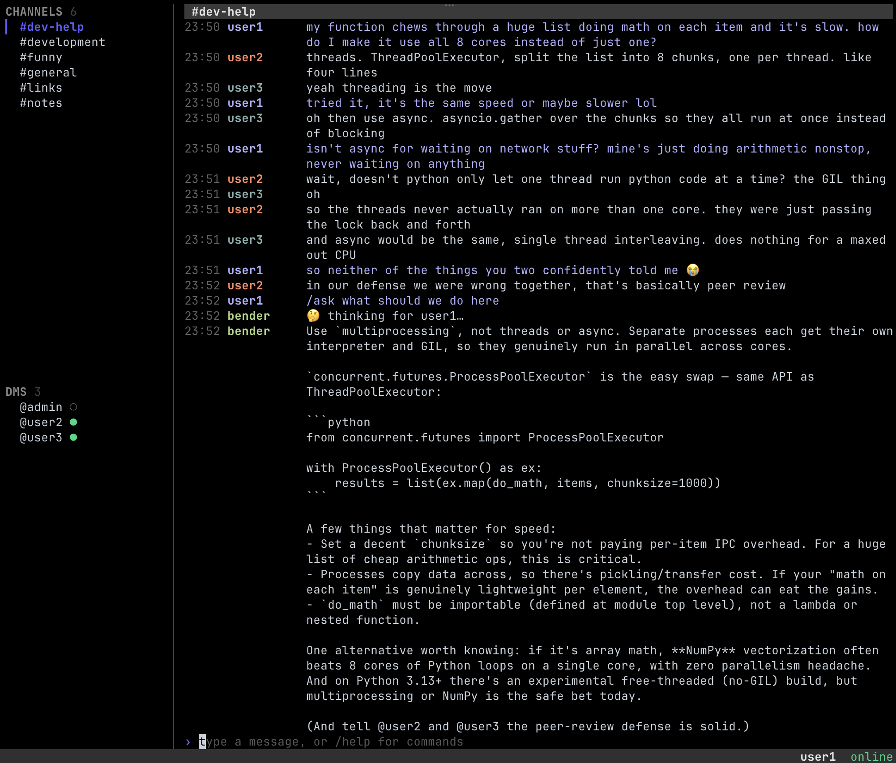

# Quorum bot SDK (Python)

Python SDK for building [Quorum](https://github.com/clwg/quorum) chat bots. A bot is an ordinary chat client that authenticates with a **bot token** (created in the admin TUI), joins channels, sees every message in them, and responds to slash commands.



> Bots operate on **group channels only**. They have no access to end-to-end
> encrypted 1:1 DMs - by design, the server can't read those, so neither can a
> bot.

This is the Python counterpart of the Go SDK that ships in the [server repo](https://github.com/clwg/quorum) (`sdk/bot`), with the same surface.

## Install

```sh
pip install quorum-bot
```

Or from source:

```sh
git clone https://github.com/clwg/quorum-python-sdk
cd quorum-python-sdk
python3 -m venv .venv && . .venv/bin/activate
pip install -e .
```

Requires Python 3.9+. Pulls in `grpcio` and `protobuf` (7.x).

## Quick start

```python
import os
from quorum_bot import Bot

bot = Bot("chat.example.com:8443", os.environ["QUORUM_BOT_TOKEN"])

@bot.command("ping", "replies with pong")
def ping(c):
    c.reply("pong")

bot.join_channel("general")
bot.run()  # blocks until close() / Ctrl-C
```

Against a dev server using the self-signed CA, pass the CA explicitly:

```python
bot = Bot("localhost:8443", token, ca_file="certs/ca.pem")
```

## API

### `Bot(server_addr, token, *, ca_file=None, logger=None)`
Dials the server and prepares an authenticated bot. The token **must** start with `qbot_`; anything else raises `ValueError`. Dialing verifies TLS, but the token is not validated until `run()`.

| Argument | Effect |
| --- | --- |
| `ca_file` | Trust a private CA (e.g. the dev CA from `quorum-gencert`). Without it, system roots are used. |
| `logger` | Replace the default `quorum.bot` `logging.Logger`. |

### `bot.command(name, help, handler=None)`
Register a slash-command handler. `name` is matched without the leading slash, case-insensitively; `help` shows up in the `/commands` listing. Use it directly (`bot.command("ping", "...", fn)`) or as a decorator:

```python
@bot.command("roll", "roll dice, e.g. /roll 2d6")
def roll(c):
    c.replyf("%s rolled", c.sender.username)
```

The handler receives a `Command` with `name`, `raw_args` (everything after the command word), `args` (`raw_args` split on whitespace), `channel_id`, and `sender` (`User(id, username)`). Reply with `c.reply(text)` or `c.replyf(fmt, *args)` (printf-style). **Raise** to signal failure - the SDK logs it and replies `⚠ command failed: <err>` in-channel.

### `bot.on_message(handler=None)`
Optional. Fires for **every** channel message the bot sees, command or not.  The handler receives a `Message` with `channel_id`, `sender`, `text`, and its own `reply`. Usable directly or as a decorator.

### `bot.join_channel(name)`
Joins the named channel, **creating it if it doesn't exist**. Call before `run()`, or any time after.

### `bot.send(channel_id, text)`
Post to a channel by ID (when not replying to a specific message).

### `bot.run()`
The main loop. Validates the token with `WhoAmI` (raising `RuntimeError("bot: token rejected: …")` on failure), then pumps the event stream and dispatches handlers. **Blocks.** Stops on `KeyboardInterrupt` (Ctrl-C) or when `close()` is called from another thread.

### `bot.close()`
Tear down the connection and stop `run()`.

## Behavior you get for free

- **Loop protection.** The bot never reacts to its own messages.
- **Exception recovery.** An exception in a handler is caught and logged; it
  won't crash the bot.
- **Reconnect + re-registration.** The underlying client reconnects with backoff. After every (re)connect the SDK **re-registers** the bot's commands, so `/commands` stays correct across reconnects.
- **Duplicate-command warnings.** If another bot already claimed a command name, `RegisterCommands` returns the dupes and the SDK logs a warning.

## Concurrency

`on_message` and command handlers run in their **own threads** (the SDK dispatches each message on a fresh daemon thread, mirroring the Go SDK's per-message goroutines), so a slow handler never stalls the event pump. If your handlers touch shared state, guard it.

## Examples

- [`examples/dicebot.py`](examples/dicebot.py) - `/roll NdS` rolls dice.
- [`examples/claudebot.py`](examples/claudebot.py) - `/claude <query>` shells
  out to the Claude CLI, with a quick ack and chunked replies (the server caps
  messages at 4096 bytes).
- [`examples/claude_assistant.py`](examples/claudebot.py) - `/claude <query>` more complex claude integration using the claude code sdk, maintains context on the channel contents for questions and answers and can perform summaries of a channel.

```sh
# create a bot in the admin TUI, then:
export QUORUM_BOT_TOKEN=qbot_...
python examples/dicebot.py --addr localhost:8443 --ca certs/ca.pem --channel general
# in a chat client:  /roll 2d6
```

## Protobuf bindings

The gRPC/protobuf contract lives in the [server repo](https://github.com/clwg/quorum) under `proto/quorum/v1`. This SDK **vendors** the two protos it needs (`auth.proto`, `chat.proto`) under [`proto/`](proto/quorum/v1) and ships the generated bindings under [`quorum/v1/`](quorum/v1) so `pip install` needs no codegen toolchain.

To regenerate after a contract change (requires [`buf`](https://buf.build)):

```sh
make gen                       # buf lint && buf generate
# or, to first pull fresh protos from a local server checkout:
make sync-proto QUORUM_REPO=../quorum
```

The `__init__.py` files under `quorum/` are hand-maintained and are not touched by regeneration.

## License

[Apache-2.0](LICENSE).
